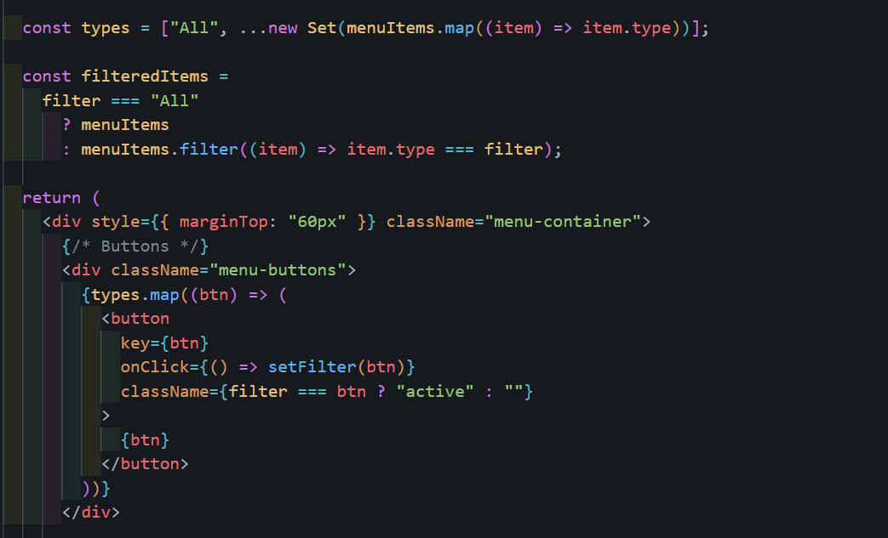
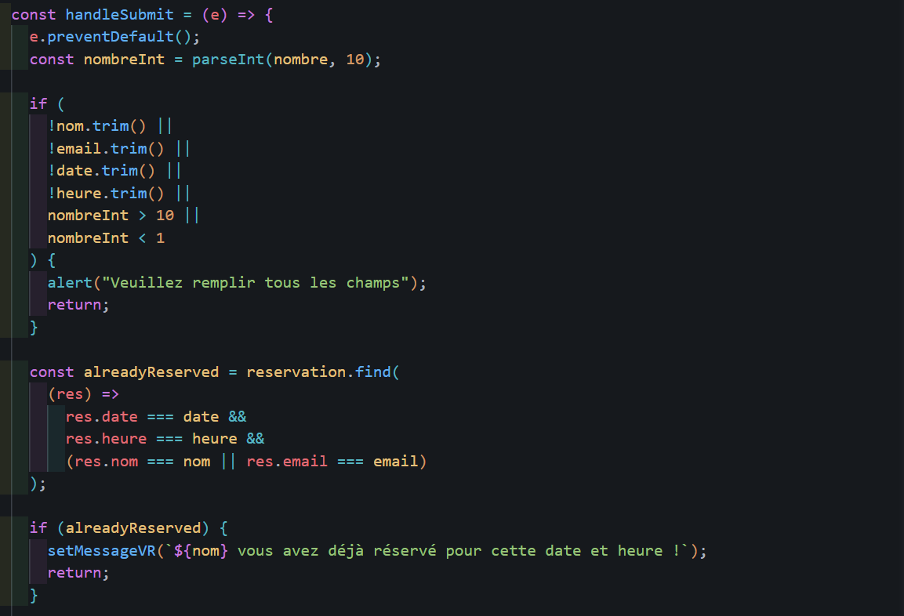

# Reservation app

## Description

GOLD Restaurant est une application web moderne développée avec React.js, conçue pour présenter un restaurant haut de gamme à travers une interface élégante, responsive et professionnelle.
Le site met en avant différents aspects du restaurant, tels que :

Une page d’accueil immersive avec un design luxueux

Une présentation du restaurant (About)

Un menu filtrable par catégories (Pizza, Burgers, Salads, Pasta, etc.)

Une galerie d’images illustrant les plats et l’ambiance

Un formulaire de réservation, avec enregistrement des données dans LocalStorage

Une navigation fluide grâce à React Router

L’objectif du projet est de fournir une plateforme numérique propre, intuitive et facile à utiliser, tout en offrant une expérience visuelle haut de gamme adaptée aux restaurants modernes.

## Structure du projet

gold-restaurant/
│
├─ src/
│ ├─ assets/
│ │ ├─ images/
│ │ ├─ img/
│ │ │
│ │ │ └─ gallery/
│ │ │ ├─ gallery-1.jpg
│ │ │ ├─ gallery-2.jpg
│ │ │ └─ ...
│ │ └─ css/
│ │ ├─ Navbar.css
│ │ ├─ Home.css
│ │ ├─ About.css
│ │ ├─ Menu.css
│ │ ├─ Gallery.css
│ │ └─ Contact.css
│ │
│ ├─ Components/
│ │ └─ Navbar.jsx
│ │
│ ├─ Pages/
│ │ ├─ Home.jsx
│ │ ├─ About.jsx
│ │ ├─ Menu.jsx
│ │ ├─ Gallery.jsx
│ │ └─ Contact.jsx
│ │
│ ├─ App.jsx
│ └─ main.jsx
│
├─ package.json
├─ vite.config.js
└─ README.md

## Technologies utilisées

**React.js** – bibliothèque principale pour construire l’interface

**React Router DOM** – gestion de la navigation entre les pages

**CSS3 personnalisé** – design moderne, animations et responsive layout

**LocalStorage** – stockage local des réservations

**UUID** – génération d’identifiants uniques pour les réservations

**JavaScript (ES6+)** – logique et fonctionnalités interactives

**Git / GitHub** – gestion et versionnement du projet

## 📸 Captures d’écran

**NavBar :**  

La barre de navigation constitue l’en-tête principal du site.
Elle contient le logo GOLD-Restaurant, ainsi que les liens vers les différentes sections : Home, About, Menu, Gallery et Book a Table.

**Button_filter_Menu :**  

Cette section du code gère le système de filtrage dynamique des éléments du menu.
Les catégories sont générées automatiquement à partir des données (menuItems) grâce à Set(), ce qui permet d’éviter la duplication des types et de garder la liste toujours à jour.

const types = ["All", ...new Set(menuItems.map((item) => item.type))];

Lorsque l’utilisateur clique sur un bouton de catégorie, l’état filter est mis à jour.
Ensuite, les éléments affichés sont filtrés en fonction du type sélectionné :
const filteredItems =
filter === "All"
? menuItems
: menuItems.filter((item) => item.type === filter);

Enfin, une liste de boutons est affichée, chacun permettant de changer la catégorie active.
Le bouton sélectionné reçoit une classe active pour indiquer visuellement le filtre courant.

**BOOK A TABLE :**  
**Gestion des États (useState):**

Le formulaire utilise plusieurs états pour stocker les informations entrées par l’utilisateur :
nom – nom du client
email – adresse email
date – date choisie
heure – heure de la réservation
nombre – nombre de personnes
message – message optionnel
reservation – liste de toutes les réservations enregistrées
messageVR – message de validation ou d’erreur

**Gestion des Effets (useEffect)**

Deux effets sont utilisés :

1_Chargement des réservations depuis localStorage au montage du composant.

2_Sauvegarde automatique des réservations dans localStorage à chaque modification.

Cela permet de conserver les données même après rafraîchissement de la page.

**Validation des Champs & Détection des Réservations Existantes**

Le formulaire vérifie :

1_champs vides

2_nombre de personnes entre 1 et 10

3_impossibilité de réserver deux fois la même date et heure avec le même nom ou email

En cas d’erreur :

message explicatif

aucune réservation n’est enregistrée

**Confirmation de Réservation**

Si toutes les informations sont valides, la réservation est enregistrée avec un ID unique (uuid).
Un message de confirmation personnalisé est affiché :

Nom du client

Date & heure de la réservation

Nombre de personnes

